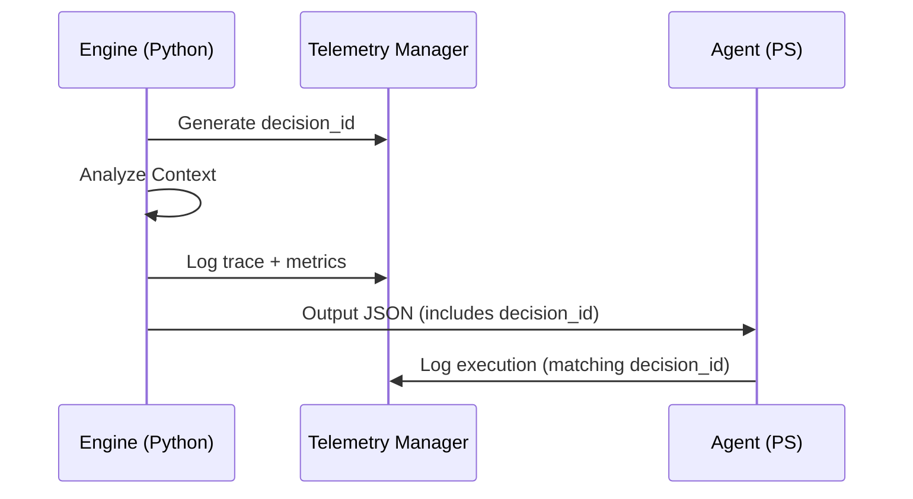

# Architecture Documentation - Optimax AI Engine

## 1. High-Level Design

The system follows a **Host-Agent** pattern, designed to be modular and scalable. The core philosophy is to decouple the **Decision Logic** (AI) from the **Execution Mechanism** (OS Interaction).

```mermaid
graph TD
    User[User / Config] -->|Defines Goal| Engine
    
    subgraph "Optimize Cycle"
        Agent[Windows Agent (PS)] -->|Context: Hardware, Processes| Engine[AI Engine (Python)]
        Engine -->|Decision: JSON Plan| Agent
        Agent -->|Execute: Scripts| System[Windows OS]
        System -->|Metrics: FPS, Latency| Agent
    end
    
    Agent -->|Feedback Loop| Engine
```

## 2. Component Detail

### 2.1 AI Engine (`src/engine`)
-   **Role**: Decision Maker.
-   **Input**: JSON containing System Info (CPU, GPU, RAM), User Goal (Gaming, Work), and current Metrics.
-   **Output**: JSON containing a list of executed actions (Scripts) with reasoning.
-   **Key Files**:
    -   `engine.py`: Entry point and orchestrator.
    -   `decision_core.py`: Logic processing (Mocked AI -> LLM Integration).

### 2.2 Windows Agent (`src/agent`)
-   **Role**: Executor & Observer.
-   **Input**: Commands from Engine.
-   **Output**: Telemetry and execution status.
-   **Key Files**:
    -   `Get-SystemContext.ps1`: Harvests hardware and software state.
    -   `Measure-Performance.ps1`: Benchmark wrapper.
    -   `Invoke-Optimization.ps1`: Safe script runner with rollback support.

### 2.3 Data Layer (`src/data`)
-   **Logs**: Audit trails of every action taken.
-   **Metrics**: JSON dumps of pre/post execution performance data.

## 3. Execution Pipeline (Hardened)

1.  **Context Gathering**:
    - Agent calls `Get-SystemContext.ps1` -> returns `context.json`.
2.  **AI Decision Layer**:
    - Agent passes `context.json` to `AI Engine`.
    - `DecisionCore` loads **Versioned System Prompt**.
    - `LLMProvider` executes call to configured AI model.
3.  **Safety & Validation Layer**:
    - Result is validated against a strict JSON Schema.
    - **Safety Gate Check**: Risks and Confidence Scores are analyzed. Overrides are applied if necessary (e.g., High Risk + Low Confidence).
4.  **Audit & Persistency**:
    - Decision metadata (version, model, status) is stored in `src/data/audit/`.
    - If errors occur, **Transparent Fallback** records the failure profile.
5.  **Local Execution**:
    - Agent parses the final (safe) plan and executes via `Invoke-Optimization.ps1`.
4. Observability & Tracing Architecture

The system utilizes a **Unified Trace ID (decision_id)** to link asynchronous events across different environments (Python and PowerShell).



### Key Safety Constraints:
- **Zero-Trust AI**: The Agent does not trust the AI's risk assessment; it relies on the Engine's hardened Safety Gate.
- **Stateless Decisions**: Every cycle is independent and context-aware, preventing "configuration drift".
- **Immutable Traces**: Once an audit log is written for a `decision_id`, it serves as a permanent record of the AI's intent at that specific millisecond.
