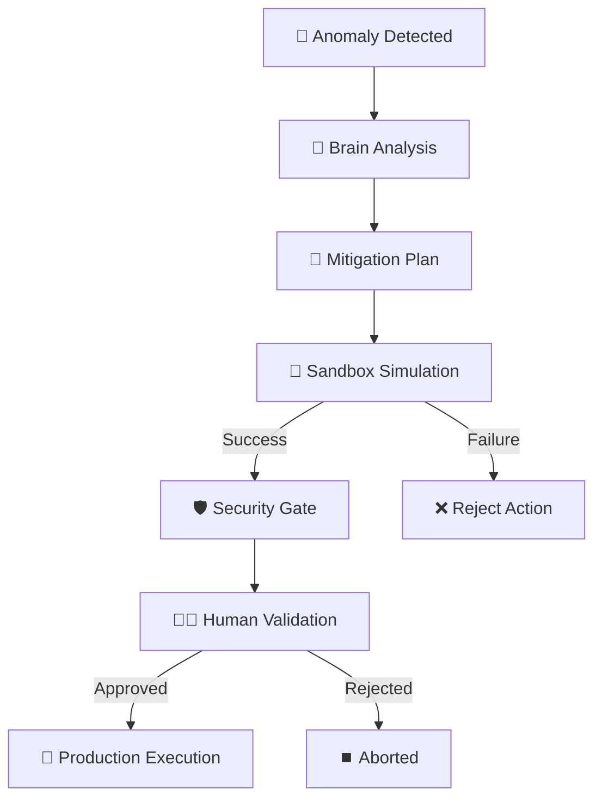

# 🛡️ Guardian — AI-Assisted SRE First Responder


**Guardian** es un sistema experimental de observabilidad activa y respuesta asistida por IA, diseñado como un *primer respondiente* ante fallos de infraestructura.

El proyecto está construido bajo una filosofía central:

> **“Proteger, no automatizar a ciegas.”**

Guardian no ejecuta acciones de forma autónoma.  
Observa, razona, simula y **solicita validación humana** antes de cualquier cambio.

---

## 🎯 Objetivo del Proyecto

Reducir la brecha entre:
- la detección de un fallo crítico  
- y la intervención humana calificada  

proporcionando **diagnósticos explicables**, **simulaciones seguras** y **propuestas de mitigación verificadas**.

Este proyecto prioriza **criterio, seguridad y trazabilidad** por sobre la automatización agresiva.

---

## ⛓️ The Decision Chain

Guardian sigue un camino riguroso desde que detecta un problema hasta que propone una solución. Cada paso es verificable y auditable.



1.  **Anomaly**: Detección de patrones irregulares en logs o métricas.
2.  **Reasoning**: La IA genera una hipótesis de causa raíz y un plan.
3.  **Simulation**: Se prueba el comando en un entorno espejo aislado.
4.  **SimulationResult**: Solo si el resultado es 100% satisfactorio, se procede.

---

## 🧠 Filosofía de Diseño

- La IA **no es autoridad**
- Ninguna acción puede ejecutarse sin **simulación previa**
- El humano siempre tiene la **decisión final**
- El sistema explica:
  - qué detectó  
  - qué razonó  
  - qué probó  
  - y con qué resultado  

Guardian está pensado como un **copiloto SRE**, no como un bot de ejecución.

---

## 🔐 Security Gate: The Core Pillar

El sistema implementa un **Security Gate obligatorio** mediante decoradores de Python. Esta es la característica principal de seguridad que garantiza la filosofía de "Proteger, no Controlar".

### Cómo funciona:
- **Validación Forzada**: El método de ejecución en producción está decorado con `@require_simulation`.
- **Bloqueo Activo**: Si un plan llega a la fase de ejecución sin haber pasado por el **Sandbox** o si el `SimulationResult` es negativo, el sistema bloquea el hilo de ejecución automáticamente.
- **Inmutable**: Esta regla está integrada a nivel de código, evitando errores humanos de omisión.

---

## 🧩 Arquitectura del Sistema

Guardian está dividido en módulos independientes, cada uno con una responsabilidad clara:

### 👁️ Observer
- Monitorea eventos (logs/alertas – mock en el MVP)
- Detecta anomalías y las normaliza en un objeto `Anomaly`.

### 🧠 Brain
- Analiza la anomalía y genera una hipótesis de causa raíz.
- Propone un `MitigatedPlan` con comandos específicos y niveles de riesgo.

### 🧪 Sandbox
- Simula la acción propuesta en un entorno aislado.
- Valida configuraciones y checks de salud antes de reportar.

### 🧑‍💻 Interface
- Presenta el razonamiento completo al humano
- Solicita aprobación explícita antes de cualquier ejecución

---

## ▶️ Ejecución del MVP

```bash
# Instalar dependencias
pip install -r requirements.txt

# Ejecutar el núcleo de Guardian
python guardian_core/main.py
```
